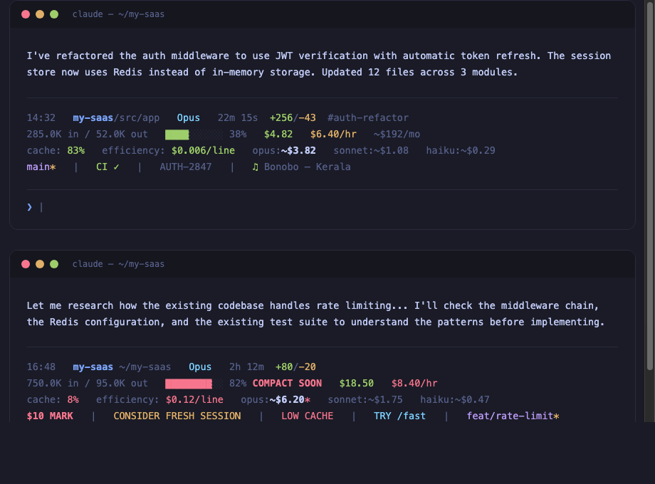

<p align="center">
  <h1 align="center">claudetop</h1>
  <p align="center"><strong>You're spending $20/day on Claude Code and can't see it.</strong></p>
  <p align="center">claudetop shows you exactly where your tokens and dollars go — in real time.</p>
  <p align="center">
    <a href="#install"></a>
    <a href="LICENSE"></a>
    <a href="#plugins"></a>
  </p>
</p>

---

<p align="center">
  
</p>

```
14:32  my-project/src/app  Opus  20m 0s  +256/-43  #auth-refactor
152.3K in / 45.2K out  ████░░░░░░ 38%  $3.47  $5.10/hr  ~$174/mo
cache: 66%  efficiency: $0.012/line  opus:~$3.20  sonnet:~$0.88  haiku:~$0.23
in:80% out:20% (fresh:15% cwrite:7% cread:76%)
$5 MARK  |  main*  |  ♫ Artist - Song  |  PROJ-123  |  CI ✓
```

## The problem

Claude Code doesn't show you what you're spending. You finish a session, check your billing dashboard, and discover a $65 charge for what felt like 30 minutes of work. You have no idea which session caused it, which model was wasteful, or whether your cache was even working.

I built claudetop after noticing my model estimate showed $10 but the actual bill was $65. Turns out, compaction was hiding 80% of my token usage. The cost was real — the visibility wasn't.

## Install

### Clone and install (recommended)

```bash
git clone https://github.com/liorwn/claudetop.git
cd claudetop && ./install.sh
```

### One-liner

```bash
curl -fsSL https://raw.githubusercontent.com/liorwn/claudetop/main/install.sh | bash
```

### As a Claude Code plugin

```bash
claude plugin marketplace add liorwn/claudetop
claude plugin install claudetop
```

This gives you the SessionEnd hook + all slash commands (`/claudetop:stats`, `/claudetop:dashboard`, `/claudetop:branch`, `/claudetop:export`, `/claudetop:pricing`) automatically.

Then restart Claude Code.

## What you see

### Before claudetop
```
>
```
A blank prompt. No context. No cost. No idea.

### After claudetop
```
14:32  my-project/src/app  Opus  20m 0s  +256/-43  #auth-refactor
152.3K in / 45.2K out  ████░░░░░░ 38%  $3.47  $5.10/hr  ~$174/mo
cache: 66%  efficiency: $0.012/line  opus:~$3.20  sonnet:~$0.88  haiku:~$0.23
$5 MARK  |  TRY /fast  |  main*  |  CI ✓  |  ♫ Bonobo - Kerala
```

Every response, you see:
- **What project** you're in and how deep
- **What model** is running and for how long
- **What it costs** right now, per hour, and projected monthly
- **How efficient** your cache is (are you wasting tokens?)
- **What it would cost** on a different model (should you switch?)
- **Smart alerts** when something is wrong

## Features

### Real-time cost tracking
Your actual session cost (green), burn rate per hour, and monthly forecast extrapolated from your history. No more billing surprises.

### Model cost comparison
See what your session would cost on Opus, Sonnet, or Haiku — with **cache-aware pricing** that accounts for your actual cache hit ratio. The current model is **bolded** so you can instantly compare.

Pricing updates automatically from the [pricing.json](pricing.json) in this repo — when Anthropic changes prices, claudetop stays current.

### Cache efficiency
Your cache hit ratio tells you if you're being efficient. Green (≥60%) means most of your input tokens are being reused. Red (<30%) means something is forcing full re-reads — maybe compaction, maybe a model switch.

### Smart alerts
Only appear when something needs your attention:

| Alert | What happened | What to do |
|-------|--------------|------------|
| `$5 MARK` / `$10` / `$25` | Cost milestone crossed | Gut-check: am I getting value? |
| `OVER BUDGET` | Daily budget exceeded | Wrap up or switch models |
| `CONSIDER FRESH SESSION` | >2hrs + >60% context | Start fresh — diminishing returns |
| `LOW CACHE` | <20% cache after 5min | Context was reset, tokens being re-read |
| `BURN RATE` | >$15/hr velocity | Runaway subagents or tight loops |
| `SPINNING?` | >$1 spent, zero code output | Stuck in a research loop |
| `TRY /fast` | >$0.05/line on Opus | This task doesn't need the biggest model |
| `COMPACT SOON` | Context window >80% full | Auto-compaction is imminent |

### Session history & analytics

Every session is automatically logged. See where your money goes:

```bash
claudetop-stats              # Today's summary
claudetop-stats week         # This week
claudetop-stats month        # This month
claudetop-stats all          # All time
claudetop-stats tag auth     # Filter by tag
```

```
claudetop-stats  This Week
──────────────────────────────────────────────────────

Summary
  Sessions:     12
  Total cost:   $47.30
  Avg / session:  $3.94
  Daily avg:      $9.46

Cost by model
  claude-opus-4-6:       $38.20
  claude-sonnet-4-6:     $9.10

Top projects by cost
  rri-os                 $22.50  (4 sessions)
  pistol-claw            $14.80  (5 sessions)
  the-table              $10.00  (3 sessions)
```

### Session tagging

Track costs per feature, bug, or initiative:

```bash
export CLAUDETOP_TAG=auth-refactor
# ... work on auth ...
claudetop-stats tag auth-refactor
# Total cost: $12.40 across 3 sessions
```

### Daily budget

```bash
export CLAUDETOP_DAILY_BUDGET=50
```

Shows `budget: $12 left` at 80% → `OVER BUDGET ($52/$50)` when exceeded.

### Themes

```bash
export CLAUDETOP_THEME=full      # Default: 3-5 lines
export CLAUDETOP_THEME=minimal   # 2 lines
export CLAUDETOP_THEME=compact   # 1 line
```

### iTerm2 integration

Push claudetop data into iTerm2's chrome — tab titles, status bar, and badge watermark:

```bash
export CLAUDETOP_ITERM=all           # Enable everything
export CLAUDETOP_ITERM=title         # Tab/window title only
export CLAUDETOP_ITERM=badge         # Watermark overlay only
export CLAUDETOP_ITERM=statusbar     # User variables for status bar
export CLAUDETOP_ITERM=bgcolor       # Background color tint by state
export CLAUDETOP_ITERM=title,badge   # Combine any options
```

**Tab title** — Shows `project | $4.21 | Opus 4.6 | ctx:38%` in your iTerm2 tab. Zero configuration.

**Badge** — Faint watermark in the terminal background with cost, model, and context at a glance. Great for keeping cost visible while scrolling through output.

**Background color** — Subtly tints the terminal background based on session state:

| Tint | Meaning |
|------|---------|
| Green | Healthy session (low context, under $5) or session ended (idle/waiting) |
| Amber | Caution — cost milestone, compact soon, low cache, spinning |
| Red | Alert — over budget, burn rate spike, $25 mark |
| Default | Normal — no special state, uses your profile's background |

When a session ends, the background stays green so you can see at a glance which terminals are idle vs active. Resets to default when the next session starts clean.

**Status bar** — Sets iTerm2 user-defined variables that you can display in the status bar (top or bottom of terminal). Configure in iTerm2: Preferences > Profiles > Session > Status Bar > add "Interpolated String" components:

| Variable | Content | Example |
|----------|---------|---------|
| `\(user.claudetop_cost)` | Session cost | `$4.21` |
| `\(user.claudetop_model)` | Current model | `Opus 4.6` |
| `\(user.claudetop_ctx)` | Context usage | `38%` |
| `\(user.claudetop_project)` | Project name | `my-project` |
| `\(user.claudetop_duration)` | Session time | `20m 0s` |
| `\(user.claudetop_cache)` | Cache hit ratio | `66%` |
| `\(user.claudetop_velocity)` | Burn rate | `$5.10/hr` |
| `\(user.claudetop_tokens_in)` | Input tokens | `152.3K` |
| `\(user.claudetop_tokens_out)` | Output tokens | `45.2K` |
| `\(user.claudetop_lines)` | Lines changed | `+256/-43` |
| `\(user.claudetop_tag)` | Session tag | `#auth-refactor` |

No-op on non-iTerm2 terminals — escape sequences are silently ignored.

### Context composition

See what's eating your context window:
```
in:80% out:20% (fresh:15% cwrite:7% cread:76%)
```

High `cread` = cache is working well. High `fresh` = re-reading files every turn.

## Plugins

Drop any executable script into `~/.claude/claudetop.d/` — it becomes part of your status line.

**Included (enabled by default):**

| Plugin | What it shows |
|--------|-------------|
| `git-branch.sh` | `main*` (branch + dirty indicator) |

**Example plugins (copy to enable):**

```bash
cp ~/.claude/claudetop.d/_examples/spotify.sh ~/.claude/claudetop.d/
```

| Plugin | What it shows |
|--------|-------------|
| `spotify.sh` | `♫ Artist - Song` (macOS) |
| `gh-ci-status.sh` | `CI ✓` or `CI ✗` (GitHub Actions) |
| `meeting-countdown.sh` | `Mtg in 12m: Standup` (macOS Calendar) |
| `ticket-from-branch.sh` | `PROJ-123` (from branch name) |
| `weather.sh` | Current weather (wttr.in) |
| `news-ticker.sh` | Top HN story |
| `pomodoro.sh` | Focus timer |
| `system-load.sh` | CPU load average |

**Write your own in 4 lines:**

```bash
#!/bin/bash
JSON=$(cat)
COST=$(echo "$JSON" | jq -r '.cost.total_cost_usd')
printf "\033[32m\$%s\033[0m" "$COST"
```

Make it executable, drop it in `~/.claude/claudetop.d/`, done.

## Dynamic pricing

Pricing updates daily from this repo. When Anthropic changes prices, we update [pricing.json](pricing.json) and everyone gets the new rates next morning.

Current pricing (Claude 4.6, March 2026):

| Model | Input | Cache Write | Cache Read | Output | Notes |
|-------|-------|-------------|------------|--------|-------|
| Opus 4.6 | $5/MTok | $6.25/MTok | $0.50/MTok | $25/MTok | |
| Sonnet 4.6 | $3/MTok | $3.75/MTok | $0.30/MTok | $15/MTok | 2x input / 1.5x output when >200K tokens |
| Haiku 4.5 | $1/MTok | $1.25/MTok | $0.10/MTok | $5/MTok | |

Extended thinking tokens are billed at standard output rates. No additional charge.

To update manually: `~/.claude/update-claudetop-pricing.sh`

## Color coding

Every metric uses traffic-light colors — green means healthy, red means act:

| Metric | Green | Yellow | Red |
|--------|-------|--------|-----|
| Cost velocity | <$3/hr | <$8/hr | ≥$8/hr |
| Cache ratio | ≥60% | ≥30% | <30% |
| Efficiency | <$0.01/line | <$0.05/line | ≥$0.05/line |
| Context bar | <50% | 50-80% | ≥80% |
| Time of day | 6am-10pm | — | Magenta after 10pm |

## Requirements

- [Claude Code](https://claude.ai/code) with status line support
- `jq` — `brew install jq` / `apt install jq`
- `bc` — pre-installed on macOS and most Linux

## Contributing

Pricing changed? Model added? [Open a PR](https://github.com/liorwn/claudetop/pulls) updating `pricing.json`. Everyone gets the update next morning.

Built a useful plugin? PRs welcome in `plugins/examples/`.

## License

MIT
